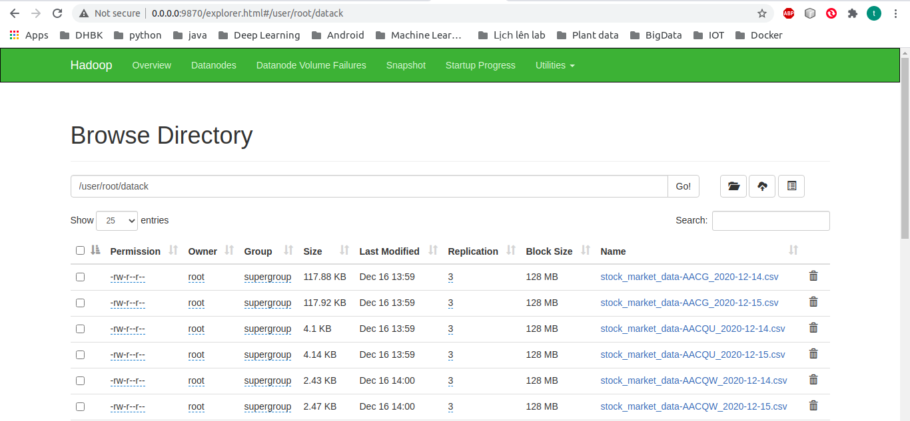

# Big Data Project: Stock Price Big Data 
Xây dựng hệ thống xử lý dữ liệu lớn trong phân tích và dự đoán xu hướng thị trường chứng khoán Việt Nam

# Tổng quan đề tài:
Thị trường chứng khoán, với hàng triệu giao dịch mỗi ngày, tạo ra một khối lượng dữ liệu khổng lồ (Big Data). Việc áp dụng các công nghệ xử lý dữ liệu lớn để phân tích nguồn dữ liệu này đã trở thành một công cụ hữu hiệu, giúp các nhà đầu tư đưa ra quyết định thông minh và hạn chế rủi ro. Bài tập này trình bày việc mô phỏng một hệ thống Big Data hoàn chỉnh để lưu trữ và xử lý dữ liệu chứng khoán. Dự án tập trung vào dữ liệu giao dịch lịch sử của thị trường Việt Nam. Kiến trúc hệ thống được xây dựng dựa trên hai công nghệ cốt lõi: Hadoop (HDFS) được sử dụng cho lưu trữ phân tán và Apache Spark được dùng cho xử lý dữ liệu song song. Dữ liệu được thu thập từ API công khai vnstock. Dự án minh họa một quy trình hoàn chỉnh từ khâu thu thập, lưu trữ phân tán đến xử lý dữ liệu chứng khoán quy mô lớn.

# Công nghệ sử dụng:
Hadoop 3.2.1 và Spark 3.4.1.
Dùng nền tảng docker để xây dựng hệ thống mô phỏng. Sử dụng các image của Apache để tạo ra namenode, các datanode, dịch vụ yarn, sparkmaster và các sparkworker. 
Sử dụng image pyspark-notebook của jupyter để demo việc xử lý dữ liệu của cụm spark (xem file docker-compose.yml)

# Kiến trúc hệ thống:
Dữ liệu được lưu trữ trên một cụm HDFS bao gồm:
- 1 Namenode để quản lý các datanode
- 4 Datanode để lưu trữ dữ liệu.
Để lấy dữ liệu ra và xử lý, nhóm demo sử dụng một cụm spark gồm 1 Spark Master và 4 Spark Worker.

# Lấy dữ liệu và lưu trữ:
Toàn bộ dữ liệu của thị trường chứng khoán Việt Nam được thu thập từ API của VnStock. Dự án này đã thu thập thông tin của 1721 công ty, đối với mỗi công ty, API được gọi để lấy dữ liệu cổ phiếu lịch sử từ ngày giao dịch đầu tiên của công ty đến ngày thu thập dữ liệu (ngày 19/10/2025). Dữ liệu của mỗi công ty được lưu vào một file .csv. Toàn bộ dữ liệu được chứa trong folder datackvn.(code crawl dữ liệu xem tại /Crwal_code/crwal_data.ipynb)
Chuyển dữ liệu vào namenode bằng lệnh sau:

```
docker cp ./datackvn namenode:datack
```

Sau đó put dữ liệu lên hdfs:

```
docker exec -it namenode  bash  (Có thể bỏ qua nếu đã trong container namenode)

hdfs dfs -put datackvn
```

Như vậy ta đã lưu trữ dữ liệu chứng khoán thành công, có thể xem cách hệ thống hdfs phân bố dữ liệu qua các lệnh hdfs trên namenode hoặc truy cập vào địa chỉ của namenode trên browser, trong trường hợp này là 0.0.0.0:9870 (tùy vào cổng được config trong file docker-compose, thường là 9870).



# Xử lý dữ liệu:

Việc demo thực thi xử lý dữ liệu được thực hiện trên pyspark-notebook, xem file Stock_price_demo.ipynb trong thư mục notebook.

Trong quá trình chạy chương trình có thể xảy ra lỗi xung đột phiên bản, có thể khắc phục bằng cách sau:

Mở terminal trên cổng http://localhost:8888/lab/tree/work

Chạy các lệnh sau:
```
conda create --name stock_price python=3.10

pip install -r requirements.txt

python -m ipykernel install --user --name=stock_price --display-name="stock_price"
```

Sau đó, trong phần chuyển sang kernel "stock_price" để thực thi chương trình.


